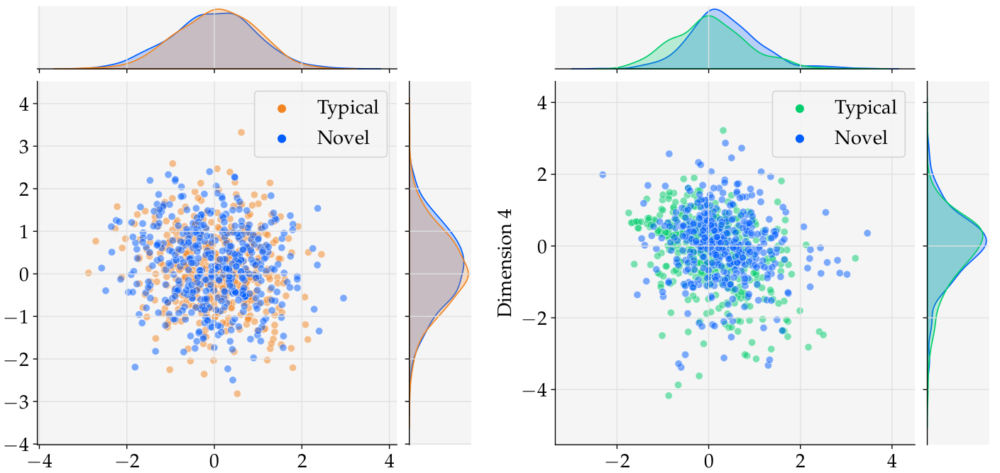
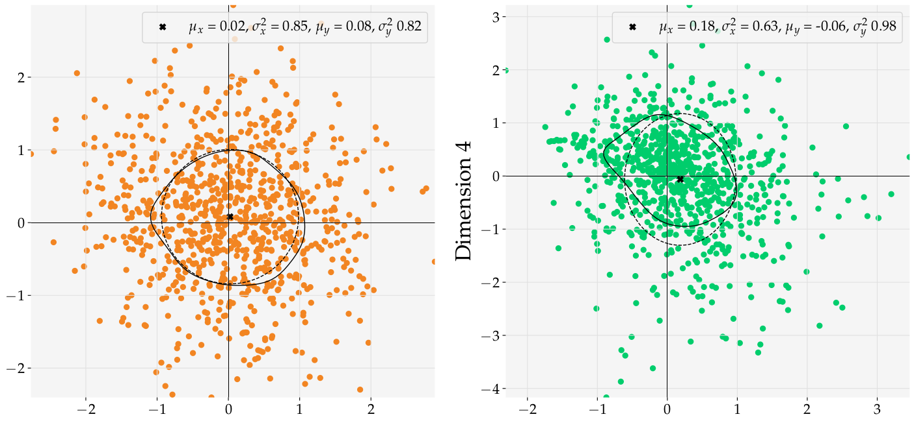
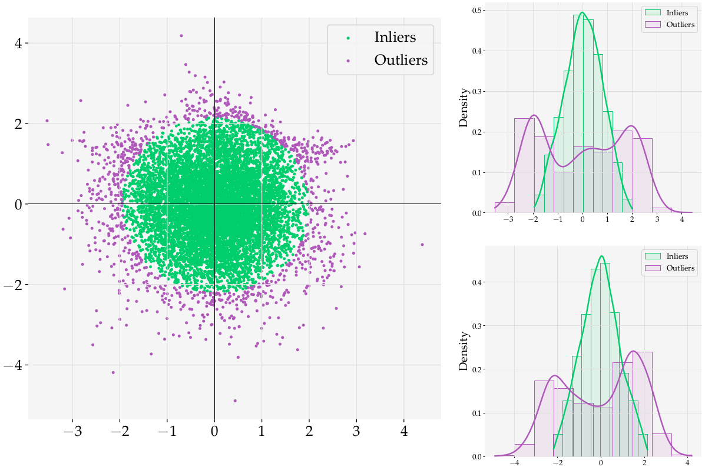

# Novelty Detection Framework

*for Planetary Exploration*


This repository was developed as part of a research endeavour in the field of image-based novelty detection, with a focus on applications in lunar and martian exploration. It provides a modular and flexible framework for image processing and machine learning research, accommodating a range of experiments from individual model evaluations to comprehensive multi-model analyses. The framework is designed for ease of use and modularity, featuring parameterizable modules and ready to use models, including CAE, VAE, and PCA. This design facilitates straightforward model swapping and efficient serialization, ensuring a
clean and understandable codebase. It serves as a crucial resource for researchers and practitioners in the domains of image processing and space exploration technology.

> [!tip]
>
> When citing this work, you can use the **Cite this repository** button to the right, or for IEEE
> ```
> B. Stefanuk and A. Pascual, Visual Novelty Detection Framework for Lunar Rovers.
> 2022. [Online]. Available: https://github.com/brahste/novelty-detection
> ```

**Related publications**

1. Stefanuk, B. and Skonieczny, K., (2022). Novelty detection in rover‑based planetary surface images using autoencoders. Front. Robot. AI, 9:974397. [doi.org/10.3389/frobt.2022.974397](https://doi.org/10.3389/frobt.2022.974397)
2. Stefanuk, B. (2021). Image-based novelty detection for lunar exploration. Master’s thesis. Montreal, Canada. Concordia University.

## Usage and Terminology

In this repository, the **experiments** form the primary research scripts; this is a good place to start if you're only interested in the results or if you prefer to read code over plain-text explanations. Experiments vary in scope from single model performance benchmarking to multi-model testing, comparison, and visualization. Typically, an experiment will use a single (or set of) **module**(s) and **dataset**(s) (sometimes referred to as datamodules or datagenerators depending on the task).

This repository is structured such that a module contains the code needed to carry out basic training functionality, and a dataset defines how the data is imported, processed, curated, and batched. A module's member functions include definitions of the training, validation, and test steps, and preperation of objective functions and optimizers. Most importantly, each module is parameterized by a **model**, which may be a CAE, a VAE, an AAE, or PCA-based. This seperataion of concerns enables a number of benefits: it allows models to be swapped in and out of their containing module with ease, allowing one to train, evaluate, and visualize many different combinations of algorithms and datasets; it allows models to be serialized independently, easing the process of preparing them for production; lastly, it helps keep the codebase modular and clean (though confusing for those new to the repo).

Training is conducted with **trainers**, scripts that synthesize the various components mentioned above and set up peripheral functionality, such as logging, callbacks, and importing configurations (**configs**).

## Methods, Results, and Visualizations

|  |
| ------------------------------------------------------------ |
| This research championed the concept Novel Region Extraction (NRE) for identifying anomalous behaviour *within* images. |

|                       |
| ------------------------------------------------------------ |
| Novel region proposals (green) demonstrating overlap with ground truth (red). Intersection over union (IOU) for these samples range from 0.63 to 0.93. |

|                    |
| ------------------------------------------------------------ |
| Precision(k) curves for reconstruction-based detections with models trained on Curiosity Mastcam. There are 430 ground truth novel samples in the dataset and 15% of the data accounts for 128 samples. |

|  |
| ------------------------------------------------------------ |
| Scatter plots of latent representations extracted during VAE and AAE training. Kernel density estimates are shown along associated axes. |

|  |
| ------------------------------------------------------------ |
| Scatter plots of latent representations extracted during VAE and AAE training. Fitted contours of a unit Gaussian and the latent distribution are shown. |

|   |
| ------------------------------------------------------------ |
| Visualization of a novelty boundary imposed on the latent distribution of an AAE. |

